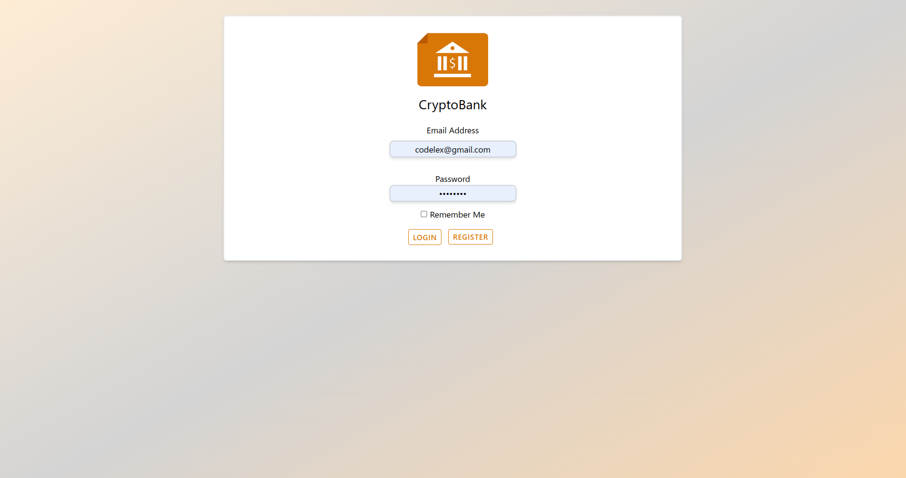
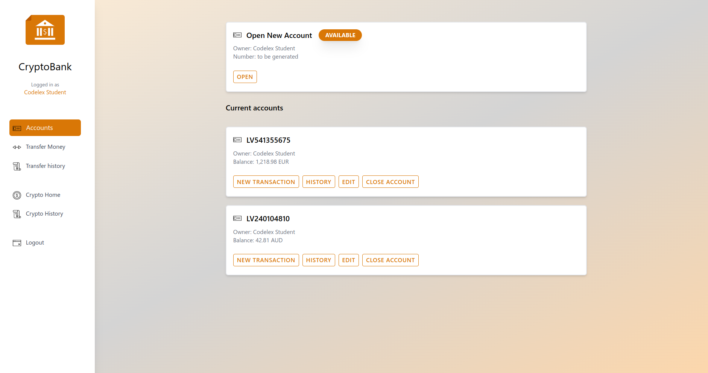
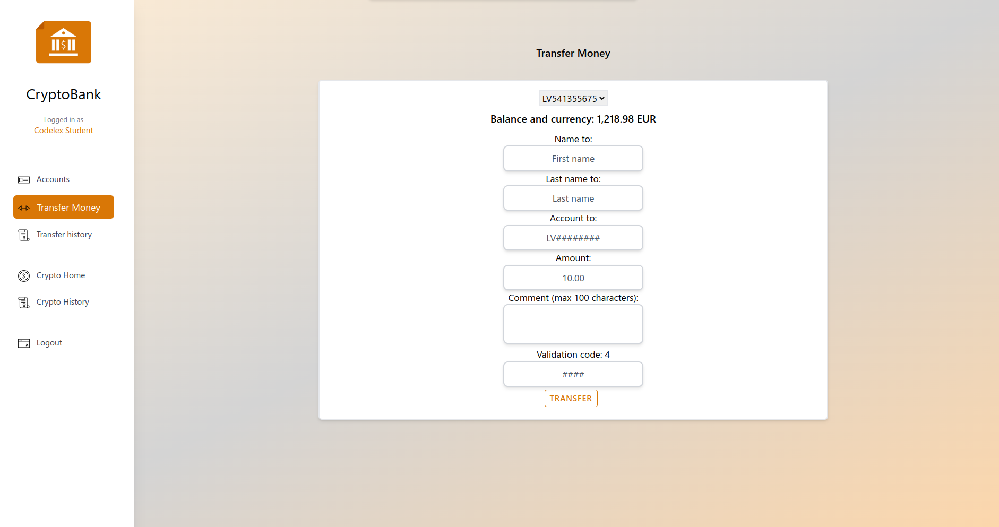
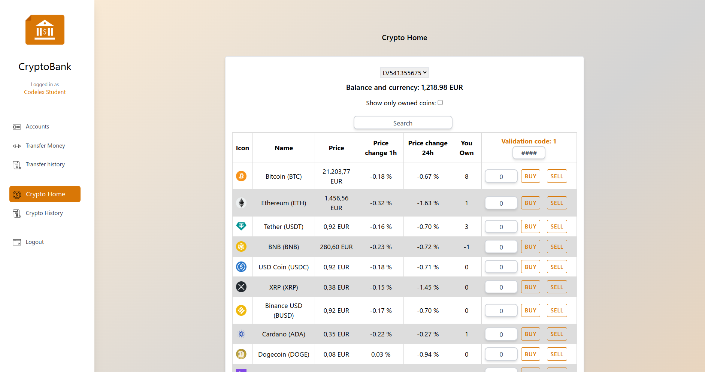

## Laravel Based CryptoBank App
### Author: [Niks Kuprēvičs](https://www.linkedin.com/in/niks-kupr%C4%93vi%C4%8Ds/)
#### This project is intended for demonstration purposes only, and is not to be used or copied without permission.

### Description
CryptoBank is a robust and secure Laravel-based
project designed to streamline the management of crypto assets. It features
advanced user registration and authentication functionality, as well as support
for multiple currencies and automatic currency conversion. 
Users have the ability to create multiple bank accounts, facilitating easy management
of their assets. Additionally, the project includes a powerful crypto transaction 
system and all forms are secure and validated to ensure user data and transactions
are protected. The user interface is intuitive and responsive, providing a seamless 
experience for managing crypto assets.

### Preqrequisites
- PHP 7.4 or higher
- Node.js 12.0 or higher
- MySQL 8.0.32 or higher
- Composer

### Used technologies
- Laravel 9.19
- CoinMarketCap API
- Vite 4.0.3
- TailwindCSS 2.2.4

### Instruction to set up the project on your local machine
1. Clone the repository
2. Set up your `.env` file
3. Run `composer install` to install all the dependencies
4. Import database files by running `php artisan migrate`
5. Run `php artisan serve` and `npm run dev` concurrently to start the project
6. Open locally hosted project link in your browser

### Features
- [x] Secure user registration and authentication
- [x] Multiple currency support with automatic currency conversion
- [x] Multiple bank accounts per user
- [x] Crypto transaction system
- [x] All forms are secure and validated
- [x] User friendly UI and responsive design

### Preview

